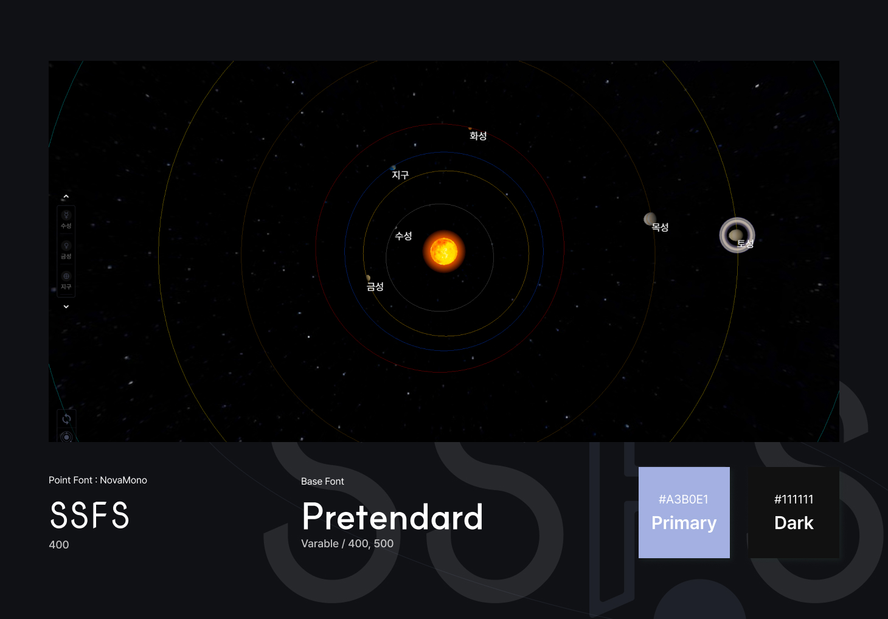

# SSFS
<p align="center">
    
</p>

## 프로젝트 소개
특수한 환경의 웹에서 UI 구성과 UX와 접근성에 대해 알아보는 것과 함께 Three.js를 활용하여 태양계를 구현하고 태양을 포함한 각 행성에 대한 이야기를 볼 수 있는 공간을 만들어보고자 제작하였습니다.<br/>
각 천체의 공전과 자전, 카메라의 이동과 제한, 뷰포트에 따른 최적화 등의 기능들을 구현하였습니다.<br/>

### 미리보기
- [https://septupleseven.github.io/ssfuns/][]

[https://septupleseven.github.io/ssfuns/]: https://septupleseven.github.io/ssfuns/
<br/>

### 관련 상세 노션
- [https://www.notion.so/SSFS-15e675d69a94809395eee903de84183d?pvs=4][]

[https://www.notion.so/SSFS-15e675d69a94809395eee903de84183d?pvs=4]: https://www.notion.so/SSFS-15e675d69a94809395eee903de84183d?pvs=4
<br/>

## STACKS   
### Base
- Three.js
- TypeScript
### lib
- SCSS
- GSAP
<br/>

## 시작하기
### 사전 요구 사항
- Node.js v20 이상

### 설치
```bash
npm install
```

### 프로젝트 실행, 빌드
```bash
npm run dev
npm run build
npm start
```
<br/>

## 콘텐츠 소개
### 기본 동작

<br/>
행성을 클릭하면 해당 행성을 줌인하고 행성의 정보를 노출합니다. 행성만이 아니라 행성의 이름 등을 선택하여도 같은 결과를 확인할 수 있습니다.
<br/>
### 숏컷

<br/>
좌측 가운데의 슬라이드 버튼을 통해서 빠르게 행성에 접근할 수 있습니다.
<br/>
### 시점 조정

<br/>
카메라가 틀어져서 초기화가 필요하거나 수평, 수직으로 보고 싶을 때, 좌측 하단 버튼을 통해서 시점 변경을 할 수 있습니다.
<br/>
<br/>
### 반응형


<br/>
반응형 레이아웃이 적용되어 있습니다. 원활한 진행은 데스크탑 환경에서 진행하는 것을 권장드립니다.

## 자료 참조
- 아폴로상 모델 참조
  - [sketchfab](https://skfb.ly/VOzu)
- 이미지 참조
  - [NASA](https://www.nasa.gov/)
- 텍스처 참조
  - [solarsystemscope](https://www.solarsystemscope.com/)
- 텍스트 내용 참조
  - [starwalk](https://starwalk.space/ko)
<br />
본 사이트는 상업적 목적으로 제작된 사이트가 아닙니다.
