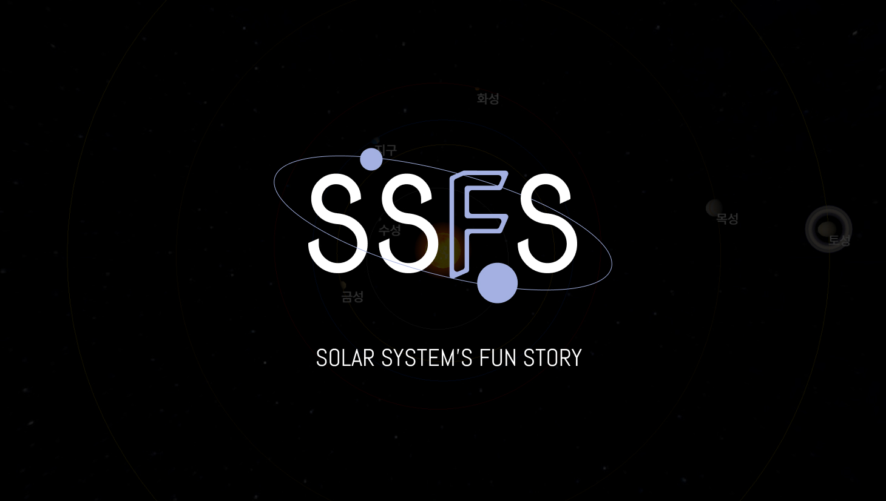

# SSFS
<p align="center">
    
</p>

## 프로젝트 소개
Three.js를 활용하여 태양계를 구현하고 태양을 포함한 각 행성에 대한 이야기를 볼 수 있는 공간을 만들어보고자 제작하였습니다.<br/>
각 천체의 공전과 자전, 카메라의 이동과 제한, 뷰포트에 따른 최적화 등의 기능들을 구현하였습니다.<br/>

### 미리보기
- [https://septupleseven.github.io/ssfuns/][]

[https://septupleseven.github.io/ssfuns/]: https://septupleseven.github.io/ssfuns/
<br/>

## STACKS   
### Base
- Three.js
- TypeScript
### lib
- SCSS
- GSAP
<br/>

## 시작하기
### 사전 요구 사항
- Node.js v20 이상

### 설치
```bash
npm install
```

### 프로젝트 실행, 빌드
```bash
npm run dev
npm run build
npm start
```
<br/>

## 콘텐츠 소개   
